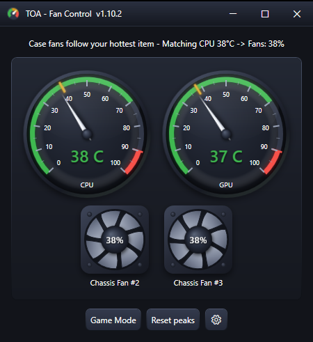
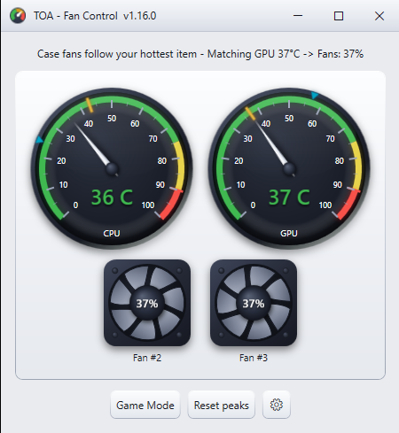
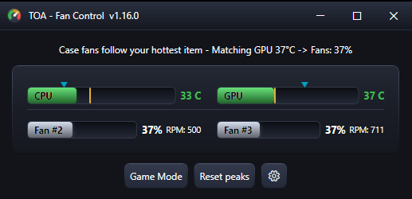
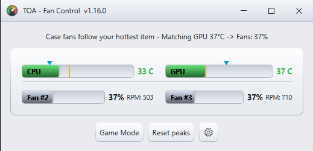
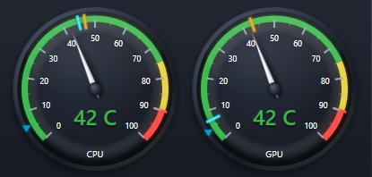
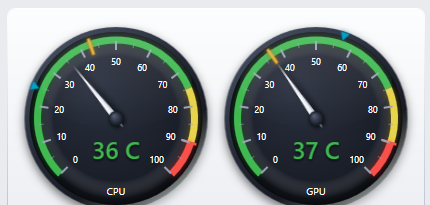
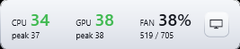
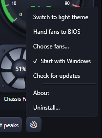

<h1 align="center">TOA - Fan Control</h1>

  <b>Zero-config fan control for Windows 10/11 64 bit PC case fans.</b> 
  <b>Your case fans follow your hottest component, the CPU or the GPU. It's that simple. That's the app.</b>

  
  &nbsp;&nbsp;&nbsp;
  
  &nbsp;&nbsp;&nbsp;
  

---

  
  &nbsp;&nbsp;
  

  
  &nbsp;&nbsp;
  

## Why this exists

Years ago I installed SpeedFan, the FanControl of its day, to cool my PC down. After installing it, I was overwhelmed with all the options, cryptic sensor names and settings I didn't understand. After about five or 10 minutes of asking myself, "What is this? What is that?," I uninstalled it. SpeedFan has been gone for a while now and its eventual successor, FanControl, is genuinely powerful… but still has the curve editors, sensor mixes and homework, that personally, I don't want.

I never wanted that type of control over my fans. I didn't want the confusion or possibility of changing a setting and cooking my PC. I wanted simplicity. Cooler parts, quiet fans, and nothing to configure. Basically, a "start it and forget it" type of app. Here it is, years later, and with the help of Claude AI, I built exactly what I wanted. Hopefully... it's what you've wanted, too.

## What it does

The app adjusts **only your PC case fans**, making them follow your hottest component — your CPU or your GPU. Every second it reads both temperatures, and the fans match the hottest reading of the last 15 seconds, one-to-one: **70°C means 70% fan speed.** Holding the recent peak keeps the fans steady when bursty loads (video encoding is the classic) make the temperature sawtooth — a real spike still raises them instantly; only the quieting-down waits. Past 70°C the fans lean up to 5 points ahead of the temperature (78°C → 83%) — extra push exactly when things are hottest.

- A hard **30% floor** means no case fan ever stalls, and changes are **rate-limited** so fans glide to the needed speed instead of jerking up and down.
- Your **AIO pumps, CPU coolers, and GPU fans are never touched** — they stay on your motherboard's BIOS control (and your GPU driver's), where they belong.
- On first run, the app shows you the case fans it found and lets you confirm which ones it may drive. Fans it recognizes as pumps or CPU/GPU coolers are never even listed.
- **No bloatware. Period.** — you get one small app and nothing else. No background services, no launcher, no account to create, no ads, no "companion" software sneaking onto your PC like so many other apps love to do. Its only two requirements — Microsoft's .NET and the PawnIO driver — are official, signed, and installed with your OK.

There are no curves, no profiles, no targets, no tuning. If that's what you want, this isn't your app — [FanControl](https://github.com/Rem0o/FanControl.Releases) is excellent. This app is for everyone who bounced off tools like that and just wants their PC to run cooler and quieter.

## Everyday use

There's nothing you *have* to do — it sits in the system tray and does its job on its own. But when you want to check in on things, you get:

- **A dashboard** — CPU/GPU temperature dials or bars with peak markers, plus a spinning fan tile per case fan showing the driven % (the blades spin at the fan's real speed).

  
&nbsp;&nbsp;

- **Game Mode** — a small, always-on-top, drag to place any where on your screen, temps/fans readout for gaming. Works over Borderless/Windowed Fullscreen. Nothing can draw over true exclusive fullscreen. That's a Windows rule.

  
&nbsp;&nbsp;

- **Settings (the ⚙ cog)** — dark/light theme, dial or bar display, hand fans back to BIOS anytime, choose fans, start with Windows (boots silently into the tray), Check for updates, About and a full uninstall.

  

- **The load telltale** — the cyan triangle sweeps with your GPU's load *right now*, and a cyan line parks at the highest load of the run, like a race tach's telltale pointer. On the GPU it's TRUE load — watts pulled versus your card's maximum, from a built-in library of ~160 cards. Card not listed? The app asks once: a one-click search finds your card's TDP, you type one number, done forever.

- **Self-maintaining prerequisites** — the app checks PawnIO and .NET for updates daily (if you leave your PC on continuously) and at app launch. The app only downloads official signed installers, verifies their signatures and never interrupts you mid-game with a popup.

## If the app ever fails, your BIOS takes over. Every time.

This is the design promise: **there is no failure that leaves your fans stranded.**

<table align="center">
  <tr><th>What happens</th><th>Result</th></tr>
  <tr><td>You close the app</td><td>Fans back to BIOS control</td></tr>
  <tr><td>The app crashes</td><td>Fans back to BIOS control</td></tr>
  <tr><td>The app is force-killed (Task Manager)</td><td>A watchdog process restores BIOS control</td></tr>
  <tr><td>Temperature readings vanish</td><td>Fans handed to BIOS within 3 seconds</td></tr>
  <tr><td>Windows shuts down or you log off</td><td>Fans back to BIOS control</td></tr>
  <tr><td>You uninstall</td><td>Fans back to BIOS control</td></tr>
</table>

Worst case, your PC behaves exactly as it did before you installed this. Every one of those paths has been tested on real hardware.

## Requirements

- **Windows 10 or 11, 64-bit.** That's the only requirement you need to meet yourself.
- Administrator access — the app asks automatically (required to talk to the motherboard's fan hardware).
- .NET 10 and the PawnIO driver — **the installer handles both** if they're missing, with your permission.

Windows only, by design. No Linux/SteamOS version is planned — that world already has native tools.

## Installing

1. Download **`TOA - Fan Control Setup.exe`** from the [Releases](../../releases) page.
2. Run it. **Windows will show a blue "Windows protected your PC" warning** — that's SmartScreen reacting to an unsigned open-source app with no download reputation yet, not a threat detection. Click **More info → Run anyway**. (Don't take my word for what the app does — the entire source code is this repository.)
3. The installer checks for .NET 10 and PawnIO (installs them if needed, telling you first), asks where you want the app installed (drive letter, etc.), adds it to your Start menu, and offers a desktop shortcut.
4. First launch shows you the fans it found — uncheck anything that isn't a regular case fan, hit Save, done.

**Rolling back:** every version stays downloadable on the Releases page. If an update ever misbehaves on your hardware, grab the previous installer and run it.

## FAQ

**Why does it need administrator?**
Fan speed lives on the motherboard's Super I/O chip, which Windows only exposes to elevated processes via a signed kernel driver (PawnIO — the same signed driver modern hardware tools use).

**So which PCs does it actually work on?**
The dividing line is the motherboard:
- **Retail motherboard** (ASUS, MSI, Gigabyte, ASRock…) → standard fan-control chip → the app works. That covers home builds, and also the gaming-shop prebuilts — iBuyPower, CyberPower, NZXT BLD, Micro Center builds — since they assemble from retail parts.
- **Big-box machines** (Dell, HP, Lenovo) → custom board, fans on their own locked controller → temp dashboard only, fans stay on the factory's tuning.

**Does it work on laptops?**
It'll show your temps, but laptop fans are run by the laptop's own embedded controller, which is proprietary per model. The app leaves them alone — the same safety rule that never touches your CPU cooler on a desktop. This app is for desktop case fans.

**It says "no controllable fans found" on my Dell / HP / Lenovo desktop.**
Same story as laptops: the big brands often skip the standard fan-control chip and run the fans from their own proprietary controller, which they've tuned at the factory and locked down. The app can't safely talk to those, so it leaves your fans on the manufacturer's control and runs as a temperature dashboard instead. It's happiest on a PC where you (or your builder) picked the motherboard.

**Is this related to Rem0o's [Fan Control](https://github.com/Rem0o/FanControl.Releases)?**
No — no affiliation. That's the powerful, fully-customizable one (and it's excellent). This is the zero-config one. Different apps, different philosophies, same love of quiet and cool PCs.

**Why doesn't it have fan curves, profiles, or settings to tune?**
Because that's the whole point. The app has one rule: match the case fans to whichever is hotter, your CPU or your GPU. Everything else — the 30% no-stall floor, the gentle ramps, the automatic BIOS hand-back, the watchdog — is built in, with nothing to tune and nothing to get wrong. If you enjoy building custom curves, [FanControl](https://github.com/Rem0o/FanControl.Releases) is fantastic. If you'd rather install it once and never think about it again, that's exactly what this app is for.

**Why not just use a BIOS fan curve that does what TOA - Fan Control does?**
Because most BIOS curves can't. On most boards, case-fan curves follow the CPU only — the BIOS can't see your GPU. So in games, when the GPU is the hottest thing in the case, BIOS-driven case fans just idle. This app watches both chips every second and matches the fans to the hotter one's recent peak — no reboots to tweak anything, and if the app ever closes, your BIOS curve takes right back over. (Already have a curve you love? Keep it — this is for everyone who doesn't want that homework.)

**Why doesn't it control the CPU fan?**
On purpose. Your CPU cooler stays on the BIOS so that no failure of this app can ever starve your CPU of cooling. The same rule protects AIO pumps (throttling a pump is the one genuine landmine in fan software) and your GPU's fans (the GPU's own driver runs those best). This app manages the case airflow *around* your components; their own coolers always keep the motherboard as their safety net.

**What do the color zones on the dials mean?**
They're about speed first and safety second. 
**Green** = cool enough that your chip runs at full speed. 
**Yellow** = still safe, no damage, but hot chips quietly slow themselves down a little more with each degree. 
**Red** = the chip hits its own emergency brake to protect itself. 
Hover any zone in the app and it explains itself. The bonus that rides along free: cooler parts simply last longer. Cool is fast now and alive later.

**What's the difference between "load" and "busy time" in the marker tooltips?**
Busy time is revving your pickup in neutral — the engine never rests, but nothing's being asked of it. Load is towing a loaded trailer up a grade — that's where the heat and the wear actually happen. Windows' usual "GPU utilization" number (Task Manager's too) only measures *busy*. This app shows the GPU's true **load** — watts pulled versus the card's maximum — because heat follows load, and heat is this app's whole business. The CPU's markers say "busy time" because no honest per-chip power ceiling exists to compute true load from — and this app never shows a number it can't back.

**Won't adjusting fans every second wear them out?**
No — it's a dimmer switch, not a gear shift. Speed changes are electronic (PWM), rate-limited to gentle ramps, and a degree moves the fans 1% (~15 RPM — inaudible; at most 2% per degree in the 70–75°C hand-off band). The one thing that's actually semi-hard on a fan motor is stop/start cycling, which the 30% floor makes impossible. Full explanation: [Docs/why_it_doesnt_wear_fans.md](Docs/why_it_doesnt_wear_fans.md)

**Does this touch my RGB lighting?**
Never. The app writes fan *motor* speeds on the motherboard's fan-control chip. RGB runs on entirely separate hardware (ARGB headers / USB controllers) that this app can't even see. Your light show is untouched.

**I run SignalRGB / iCUE / Armoury Crate — will they fight?**
Only if that software *also* has fan control enabled (RGB suites sometimes switch it on after updates). If something else starts overwriting fan speeds, this app detects it within seconds, temporarily re-asserts your chosen speeds faster than the other program writes them, and shows you a notification naming the fix: turn off fan control in the other app. Lighting features are never affected.

**Some sensors don't show on my brand-new hardware.**
The sensor library is deliberately version-pinned — it never updates behind your back (silent sensor-library updates breaking PCs overnight is a recurring story with other tools). Brand-new chips can lag behind support; when that happens, the app runs read-only and your BIOS keeps running the fans — nothing breaks. Support arrives via a normal, tested release. Open an [issue](../../issues) with your hardware details.

## Your data stays yours

This app collects **nothing** and transmits **nothing**: no telemetry, no analytics, no accounts, no personal data — there isn't even a server to send anything to. Temperatures and fan speeds are read from your hardware, shown on screen, and written only to a local log file next to the app. The app's only internet use is checking for updates (PawnIO from its author's GitHub, .NET from Microsoft, and the app itself from this repository), and those requests send nothing about you or your PC.

## Found a bug?

Open an [Issue](../../issues). Include the `fan_debug.log` file that lives next to the app's exe — it records exactly what the app was doing, and it contains no personal information (temperatures, fan speeds, and app events only — read it yourself first if you like).

---

**© 2026 TOA. Released under the [GNU GPLv3](LICENSE)** — free forever, and every fork must stay free and open source too. (Versions up to v1.12.2 were released under MIT.)

This software is provided "as is", without warranty of any kind, express or implied. It controls real hardware — your fans — and while it is designed to always return them to motherboard (BIOS) control and never drive them below a safe floor, you use it at your own risk. TOA is not liable for any damage to hardware, loss of data, or any other damages arising from the use of this software.
